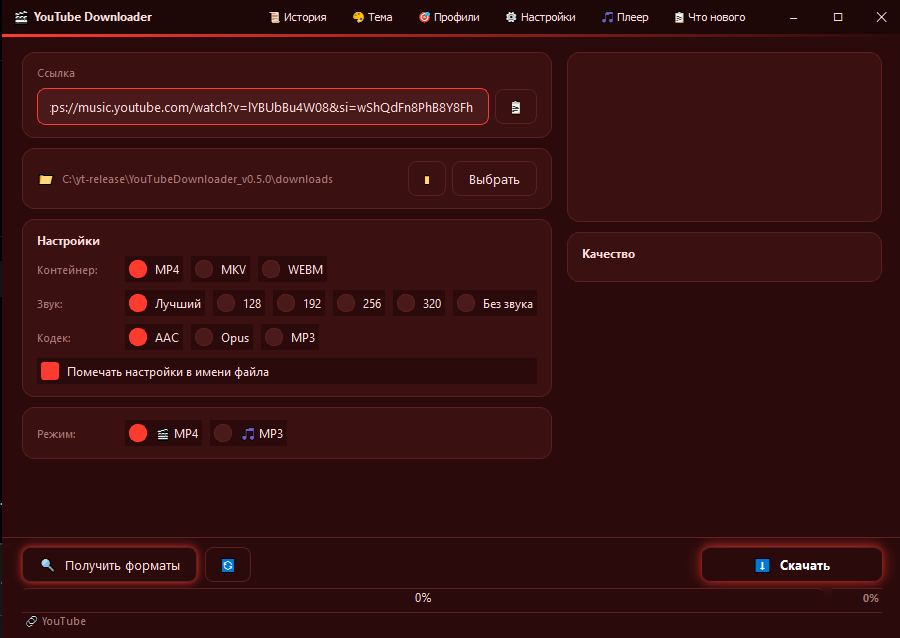
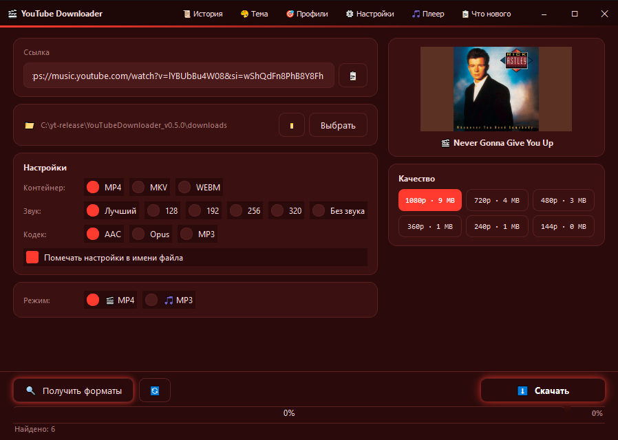
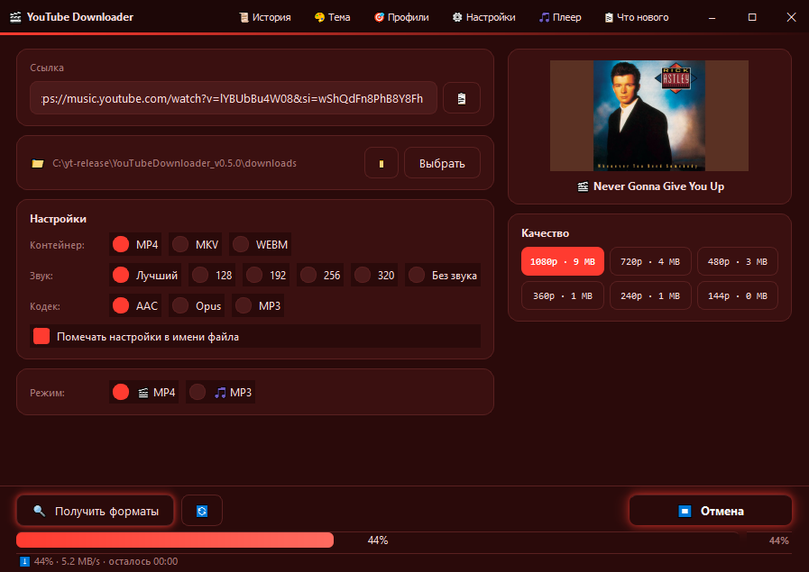

<div align="center">

# 🎬 YouTube Downloader

**Only Tube, but fucking good**

[](https://github.com/Styrbik/youtube_downloader)
[](https://www.python.org/)
[](https://styrbik.github.io/youtube_downloader/)
[](LICENSE)

Красивая качалка для YouTube, YouTube Music и других платформ.
С кастомным интерфейсом, темами, плеером и праздничными эффектами.

[](https://styrbik.github.io/youtube_downloader/#screenshots)

</div>

---

## 📸 Как это выглядит

<div align="center">

### 1. Вставь ссылку


### 2. Выбери качество


### 3. Скачивай


</div>

---

## 🎨 Две версии

Проект имеет **две версии** — Classic и Modern. **Выбор** — при **первом** **запуске** **через** **лаунчер**.

### 🌙 Classic (Tkinter) — архив
- **Финальная** **версия**: v0.4.2 «Holiday Edition»
- **Больше** **не** **обновляется** — только **стабильность**
- Всё, **что** **нужно** **для** **скачивания**, **уже** **есть**
- **Для** **тех**, **кто** **хочет** **простоту** **и** **надёжность**

### 🎨 Modern (PyQt6) — активно развивается
- **Текущая** **версия**: v0.5.0 «Qt Edition»
- **Современный** **интерфейс**, **плавные** **анимации**, **тени**
- **Праздничные** **темы** **с** **падающими** **объектами**
- **Все** **новые** **функции** — **здесь**
- **Для** **тех**, **кто** **хочет** **красоту** **и** **новизну**

### ⚠️ Что **пока** **НЕ** **доступно** **в** Modern
- 🎵 **Плеер** — **будет** **в** v0.5.1
- 🎨 **Генератор** **иконок** — **будет** **в** v0.5.1
- 🍪 **Куки** — **не** **требуются**

**Сменить** **версию** **можно** **в** **настройках** → «**🔄** **Сменить** **версию**».

---

## ✨ Возможности

### 🎨 Интерфейс
- Двухколоночный layout с плавными анимациями
- Кастомная шапка окна (не как у всех)
- 3 обычные темы: Тёмная, Бежевая, Красная
- **4 праздничные темы** с падающими объектами:
  - 🎃 Хэллоуин (31 октября)
  - 💀 Doomsday (21 декабря)
  - 🎄 Новый год (31 декабря)
  - 🌸 8 марта
- Менеджер иконок + генератор с GUI

### 🎵 Плеер (только в Classic)
- Встроенный плеер для MP3
- Пауза, стоп, прогресс-бар
- Плейлист из истории

### 🎛 Качество
- Динамические кнопки качества
- Размер файла (MB / GB)
- Подтверждение для больших файлов (>5 ГБ)

### 🖼 Обложки
- Авто-обрезка заливки YouTube Music (16:9 → 1:1)
- Вшивание обложки в MP3
- Метаданные (артист, альбом, год)
- Обложки в проводнике Windows (через Icaros)

### ⚙️ Настройки
- Отдельное окно с чекбоксами
- Автосортировка по папкам
- Автообновление yt-dlp
- Профили: Музыка 320, Видео 1080, Архив

### 🚀 Загрузка
- Кнопка «Отмена»
- ETA и скорость
- Поддержка плейлистов
- Дубликат-чек

---

## 🚀 Быстрый старт

### Windows (exe)
1. Скачай последний релиз из [Releases](../../releases)
2. Распакуй в любую папку
3. Запусти `YouTubeDownloader.exe` — откроется **лаунчер**
4. Выбери версию: **Classic** (Tkinter) или **Modern** (PyQt6)
5. Поставь галочку «**Запомнить** **выбор**», **если** **не** **хочешь** **выбирать** **каждый** **раз**

### Из исходников

```bash
git clone https://github.com/Styrbik/youtube_downloader.git
cd youtube_downloader
pip install -r requirements.txt
python downloader_launcher.py
```

**Или** **запусти** **конкретную** **версию**:
- `python downloader_dark.py` — **Classic** (Tkinter)
- `python downloader_qt.py` — **Modern** (PyQt6)

---

## 📋 Что нового

Смотри [CHANGELOG.md](CHANGELOG.md)

---

## 🛠 Технологии

- **Python 3.12+**
- **Tkinter** — Classic-версия
- **PyQt6** — Modern-версия
- **yt-dlp** — скачивание
- **Pillow** — обложки
- **mutagen** — метаданные
- **pygame-ce** — плеер (в Classic)

---

## 📜 Лицензия

MIT — делай что хочешь.

---

<div align="center">

**Сделано с ❤️ и 🎃**

</div>
